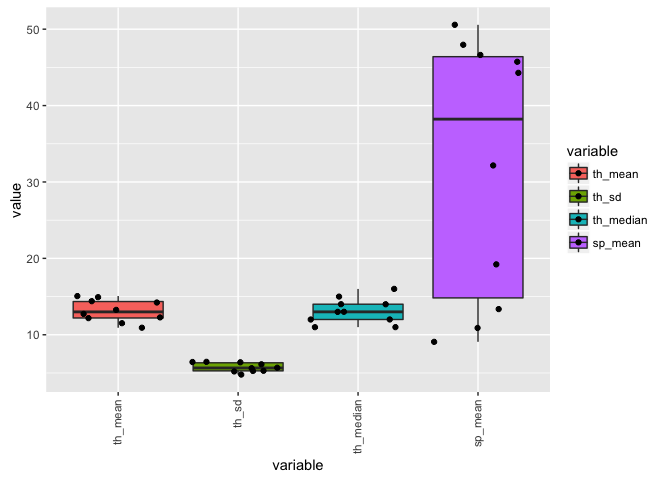
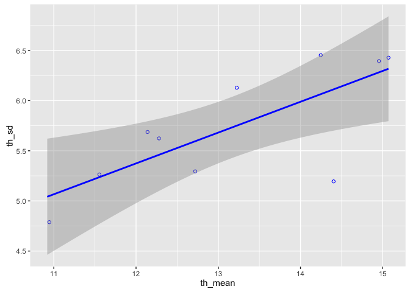
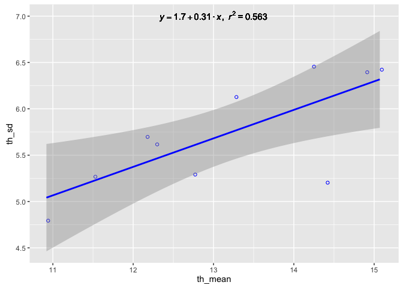
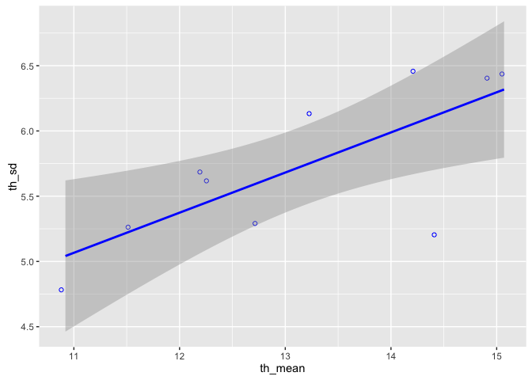
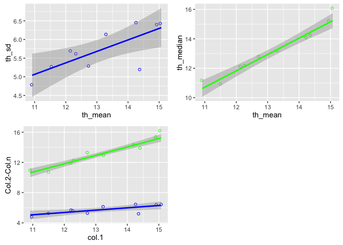
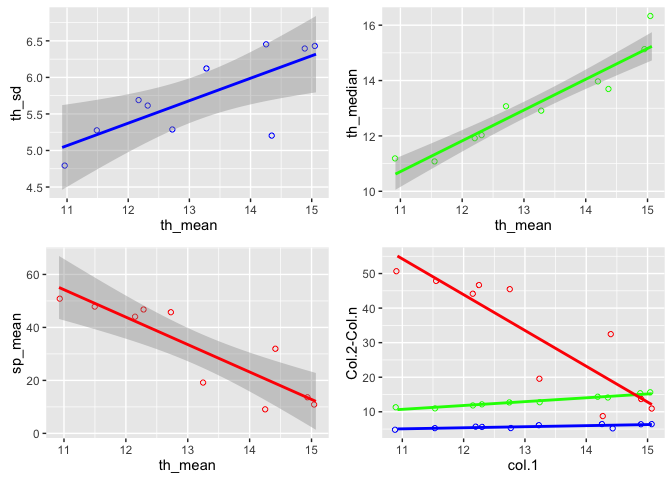

# Introduction
##### Citation Request:

This project has been carried out in collaboration with Lucid Concepts AG, Halmstad. This data belongs to the company. For more details or questions please contact company.

***
# Data exploration
## Import Data
Notes:
First, load all of the necessary packages and librarys needed to make the analysis.


```r
## import library
#install.packages('ggplot2', repos='http://cran.us.r-project.org')
library(ggplot2)
library(reshape2)
library(pastecs)
```

```
## Loading required package: boot
```

```r
library(gridExtra)
```

Note:
Load the dataset.


```r
## program...
#Open CSV-file
df_file = read.csv("input_data/file.csv")
#df_data = read.csv("input_data/data.csv")
```


```r
#Get summary
stat.desc(df_file)
```

```
##                       X     th_mean      th_sd   th_median     sp_mean
## nbr.val      10.0000000  10.0000000 10.0000000  10.0000000  10.0000000
## nbr.null      0.0000000   0.0000000  0.0000000   0.0000000   0.0000000
## nbr.na        0.0000000   0.0000000  0.0000000   0.0000000   0.0000000
## min           1.0000000  10.9200000  4.7900000  11.0000000   9.0800000
## max          10.0000000  15.0700000  6.4500000  16.0000000  50.5700000
## range         9.0000000   4.1500000  1.6600000   5.0000000  41.4900000
## sum          55.0000000 131.4900000 57.2700000 131.0000000 319.8800000
## median        5.5000000  12.9950000  5.6550000  13.0000000  38.2250000
## mean          5.5000000  13.1490000  5.7270000  13.1000000  31.9880000
## SE.mean       0.9574271   0.4601798  0.1885798   0.5259911   5.4102185
## CI.mean.0.95  2.1658506   1.0409990  0.4265971   1.1898746  12.2387645
## var           9.1666667   2.1176544  0.3556233   2.7666667 292.7046400
## std.dev       3.0276504   1.4552163  0.5963416   1.6633300  17.1086130
## coef.var      0.5504819   0.1106713  0.1041281   0.1269718   0.5348447
```


```r
#Box-Plot
ggplot(melt(df_file,id.vars = 1), aes(variable, value, fill=variable)) + #Variables/Values + color 
  geom_boxplot()+ #Create Box-Plot
  geom_jitter()+ #Show values
  theme(axis.text.x=element_text(angle=90, vjust=0.4,hjust=1)) #Fix Lables
```

<!-- -->


```r
#Column nr x-axis
x = colnames(df_file)[2]
#Column nr y-axis
y = colnames(df_file)[3]

#Regressionline
myplot1 = ggplot(df_file) + #Insert data
  geom_jitter(aes_string(x, y), shape=1, colour="blue") + 
  geom_smooth(aes_string(x, y), method=lm, se=TRUE,color="blue") #col2-3 Reg.Line
myplot1
```

<!-- -->

```r
#Equation + r^2
lm_eqn = function(m) {
  
  l <- list(a = format(coef(m)[1], digits = 2), # y-intercept
            b = format(abs(coef(m)[2]), digits = 2), # slope
            r2 = format(summary(m)$r.squared, digits = 3)); # r^2
  
  #Format equation text
  if (coef(m)[2] >= 0)  {
    eq <- substitute(italic(y) == a + b %.% italic(x)*","~~italic(r)^2~"="~r2,l)
  } else {
    eq <- substitute(italic(y) == a - b %.% italic(x)*","~~italic(r)^2~"="~r2,l)    
  }
  
  as.character(as.expression(eq));                 
}

## lm(th_sd ~ th_mean, df_file) => lm(y ~ x, df_file) => lm(col2 ~ col1, df_file) => for r^2
myplot1 + geom_text(aes(x = 13, y = 7, label = lm_eqn(lm(th_sd ~ th_mean, df_file))), parse = TRUE)
```

<!-- -->

```r
#Save plot
#ggsave(myplot2, file=args[2])
```

## Including Plots

You can also embed plots, for example:


```r
#Column nr x-axis
x = colnames(df_file)[2]
#Column nr y-axis
y = colnames(df_file)[3]

#Regressionline
ggplot(df_file) + #Insert data
  geom_jitter(aes_string(x, y), shape=1, colour="blue") + 
  geom_smooth(aes_string(x, y), method=lm, se=TRUE,color="blue") #Reg.Line
```

<!-- -->

```r
#Column nr x-axis
x = colnames(df_file)[2]
#Column nr y-axis
y1 = colnames(df_file)[3]
#Column nr y-axis
y2 = colnames(df_file)[4]

#Regressionline
complot = ggplot(df_file) + #Insert data
  geom_jitter(aes_string(x, y1), shape=1, colour="blue") + 
  geom_smooth(aes_string(x, y1), method=lm, se=TRUE,color="blue") + #col2-3 Reg.Line
  
  geom_jitter(aes_string(x, y2), shape=1, colour="green") + 
  geom_smooth(aes_string(x, y2), method=lm, se=TRUE,color="green") + #col2-4 Reg.Lin
  
  labs(x = "col.1", y = "Col.2-Col.n") #Axis Labels

p1 <- ggplot(df_file) + #Insert data
  geom_jitter(aes_string(x, y1), shape=1, colour="blue") + 
  geom_smooth(aes_string(x, y1), method=lm, se=TRUE,color="blue")           #set one color for all points
p2 <- ggplot(df_file) + #Insert data
  geom_jitter(aes_string(x, y2), shape=1, colour="green") + 
  geom_smooth(aes_string(x, y2), method=lm, se=TRUE,color="green")       #set color scale by a continuous variable

grid.arrange(p1, p2,complot, ncol=2) #Create plots with two columns
```

<!-- -->


```r
#Column nr x-axis
x = colnames(df_file)[2]
#Column nr y-axis
y1 = colnames(df_file)[3]
#Column nr y-axis
y2 = colnames(df_file)[4]
#Column nr y-axis
y3 = colnames(df_file)[5]

#Regressionline
complot = ggplot(df_file) + #Insert data
  geom_jitter(aes_string(x, y1), shape=1, colour="blue") + 
  geom_smooth(aes_string(x, y1), method=lm, se=FALSE,color="blue") + #col2-3 Reg.Line
  
  geom_jitter(aes_string(x, y2), shape=1, colour="green") + 
  geom_smooth(aes_string(x, y2), method=lm, se=FALSE,color="green") + #col2-4 Reg.Lin
  
  geom_jitter(aes_string(x, y3), shape=1, colour="red") + 
  geom_smooth(aes_string(x, y3), method=lm, se=FALSE,color="red") + #col2-5 Reg.Lin
  
  labs(x = "col.1", y = "Col.2-Col.n") #Axis Labels

p1 <- ggplot(df_file) + #Insert data
  geom_jitter(aes_string(x, y1), shape=1, colour="blue") + 
  geom_smooth(aes_string(x, y1), method=lm, se=TRUE,color="blue")           #set one color for all points
p2 <- ggplot(df_file) + #Insert data
  geom_jitter(aes_string(x, y2), shape=1, colour="green") + 
  geom_smooth(aes_string(x, y2), method=lm, se=TRUE,color="green")       #set color scale by a continuous variable
p3 <- ggplot(df_file) + #Insert data
  geom_jitter(aes_string(x, y3), shape=1, colour="red") + 
  geom_smooth(aes_string(x, y3), method=lm, se=TRUE,color="red")  #set color scale by a factor variable

grid.arrange(p1, p2, p3,complot, ncol=2) #Create plots with two columns
```

<!-- -->


